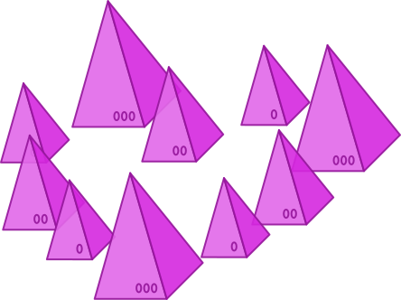

# Love Triangle

👥 Three players  
🕑 5 minutes

*Try to match interests with your object of affection while spurning the advances of your own suitor.*

The pieces in front of each player represent facets of their outward persona. Each player is trying to woo the player to their left by modifying their own persona to match the leftward player's persona, while simultaneously avoiding leading on the player to their right, who happens to be hopelessly infatuated with them.

## Equipment
- Three nests in five colors
- Pyramid Die

## Setup
1. Give each player a large, small, and medium piece of a single color. Every player must start with a different color.
2. Form a bank in the center of the table with the remainder of the pieces.

## Gameplay
On your turn, roll the white pyramid die. Depending on what it shows, you can either give a piece to the bank, take a piece from the bank, or exchange a piece with the bank. You must always obey two basic constraints:
1. **You may never have fewer than 3 pieces in front of you**, and 
2. **You may never have two identical pieces in front of you**.

If the die shows , , or , you must either:
- **Take a piece** of the size shown from the bank.
- **Give a piece** of the size shown to the bank.

If the die shows , , or , you must:
- **Swap a piece** from in front of you with a piece from the bank. The sizes of the two pieces must match the two sizes shown on the die. *e.g., if it's the medium-and-large face, you can either swap one of your mediums for one of the bank's large pieces, or one of your large pieces for one of the bank's medium pieces.*

You must take the action shown on the die face, if possible. In the event that it is not possible, you must choose any one piece from the bank to add in front of you.

Play continues until any player has at least **three matching pieces** with the player to their left. That player is considered to have successfully wooed their leftward player, and is the winner.
