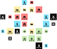

# Zoning Out

A city building game for 1 or more players.

## Equipment

- 3 trios in each of five colors (red, green, blue, yellow, black)
- One bag (three bags is better, and bowls work well as an alternative)

## Setup

Place the pyramids in the bag. If using multiple bags, sort the pyramids by size and place each size in its own bag. Choose three special scoring rules to play with for the duration of this game. You may draw them out of a hat randomly, or perhaps select three you'd like to try. You are now ready to play.

## Game Idea

During the game, you will be drawing random pyramids and adding them to your city's grid. Pyramids represent different municipal building zones. Red is Residential ("redsidential"), Yellow is Industrial ("industriyellow"), Blue is Commercial ("bluemercial"), and Green is Parks ("green space"). Black pyramids represent certain necessary, but perhaps unpleasant to be next to, facilities such as wastewater treatment plants and city dumps.

Large pyramids are large developments, and smaller ones are smaller. You will be building out your city subject to certain constraints. Generally, you want colors to be grouped together with the exception of the black pieces, which you usually want touching as few pieces as possible. Depending on which scoring rules you're playing with, these rules of thumb can vary, however.

The scoring rules you choose will have **target scores** written on them. The sum of all three target scores will determine the score you need to win.

## Game Play

Every turn you will:
- Choose which size of pyramid to place
- Draw a random pyramid of that size (by feel if using a single bag)
- Place that pyramid next to a pyramid that's already been placed -- except for your first turn, where there will of course be no other pyramids in play.
- **IMPORTANT: You may NEVER place a pyramid next to another pyramid of the same size**
- **IMPORTANT: Diagonals do not exist in Zoning Out.** You may never place diagonally, and all scoring rules ignore diagonals.
- In the very unlikely event that you are unable to place the piece you drew, due to no legal, valid spots. Return that piece and draw a piece of a different size.

When you have placed all your pyramids, proceed to scoring your new city.

## Scoring

Scoring is as follows:
- Find your largest connected group (remember: no diagonals) in each of red, blue, green, and yellow. Each of these groups scores 1 point for every pyramid within it. 
- Now score your black pyramids. Black pyramids score negatively. They subtract a value equal to their (size) x (the number of pyramids next to them). So, a 3-pip (large) black pyramid with two other pyramids next to it (of any color), would score -(3\*2) = -6 points
- Next, score your three special scoring rules. These scoring rules will have the details of how they score written on them.
- Finally, tally up your score. If your score is equal to or higher than the sum of the target scores on all three scoring rules, you win. If it's lower, you've lost.

> **Scoring Example**
> In this example game (played using fewer than normal pyramids for illustrative purposes), we would score first the largest groups in each of the four colors: Red = 4, Yellow = 3, Green = 6, and Blue = 2. This would give us 15 points. Then we subtract all the points from black pieces: -2 + -1 + -6 + -6 + -2 + -6 = -23. We get a basic score of -8! Note that two black pieces next to each other both still count against their tallies.

## Multiplayer

Though designed as a single player experience, there are a couple ways to play ZoneOut with more than one player.

### Co-operative

Play exactly as described above, but take turns drawing and placing pieces. 

### Competitive

You will need additional equipment for this mode. You will need player screens (something to hide each player's city), and you will need additional pyramids: at least 2 trios in the five colors per player. You can have some players use other colors (for example, the "xeno" colors) so long as all players agree on which color correlates to which.

To setup, draw special scoring cards as normal. These will apply to all players, but you will ignore the target score values. Each player should set up all their pieces in a place near to them as a supply. On their turn, a player **chooses** which piece they wish to play next. All players must then add that same piece type to their city (behind their screen).

Play continues this way until all pieces have been placed. Players score their own city following the usual scoring procedure. Whichever player has the highest valued city is the winner.

## Variants

### APC: Analysis Paralysis Commission

Instead of drawing pieces randomly, mix up the three sizes during setup and lay them out into three lines. During play, you can take the front piece from any line. Warning: playing like this can turn the game into a *very* think-y puzzle. It can also make the game easier to win, so if you find you are winning too often, you can up the challenge by increasing the target score by a few points whenever you play.

### Small City

This variant is good for a quicker, more relaxed game. Play with only 2 trios per color, and with only 2 special scoring rules. 

## Scoring Rules

### 15-Minute City

4 points for every red piece that is next to a blue, green, **and** yellow piece.

### Density Bonusing

-1 point for the width or height of your city in pyramids, whichever is larger.

### Rainbow Rows

5 points for every row (relative to player's view) that has at least one piece in all five colors in it.

### Colorful Columns

2 points for every column with at least three different colors in it. -3 points for any column that has less than 3 colors in it.

### Overshadowed

For every small piece, -1 point for any large pieces next to it.

### Suburbia

1 point for every red piece on the edge of the city.

### Little Boxes

3 points for every 2x2 square of red pieces within your city. Squares may overlap.

### Shopping District

3 points for every 2x2 square of blue pieces within your city. Squares may overlap.

### Linear Park

1 point for every piece in your longest line (horizontal or vertical) of green pieces. Only contiguous pieces within a single row or column count.

### "We Compost"

+(black size) points for any black next to a red piece.

### Garden City

2 points for every redsidential zone next to a park.

### Piazzas

1 point for every different color around any fully enclosed empty space within your city.

### Canadian Style

When playing with this card, large pieces may be placed adjacent to other large pieces. Score 2 points for every large piece in your biggest group of large pieces, disregarding color.

### Factory Un-fun

-2 points for every industriyellow next to a redsidential zone.

### Lines of Sight

1 point for every row or column with exactly two large pieces in it. -2 points for any row or column with less or more than 2 large pieces in it.

### Clusters

3 points for every group consisting exactly of a small, medium, and large of a single color (red, blue, green, or yellow), and no other pieces. -1 point for every group not composed thusly.

### City Wall

1 point for every large piece on the edge of the city. -2 points for every interior large.

## Scoring Sheet

You can use this table as a template for calculating your scores:

... | Score | 
----- | ------ |
Residential (red) | |
Industrial (yellow) | | 
Commercial (blue) | | 
Green space (green) | |
**Colors SUM** | |
Black | |
**(Colors - Black) Subtotal** | |
Scoring Rule #1 | |
Scoring Rule #2 | |
Scoring Rule #3 | |
**Scoring Rules SUM** | |
*Scoring Rules Targets SUM* | |
**Total** | |
